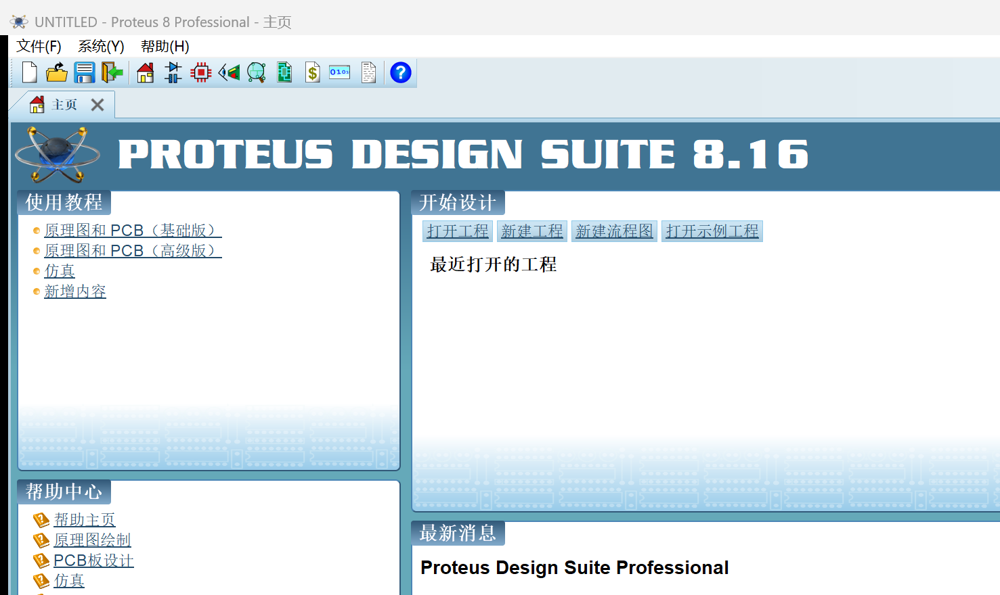

# Proteus 汉化（Proteus-zh）

高质量、可维护的 **Proteus 界面汉化语言包**与**纯 Python 工具链**。
基于 Proteus 官方多语言（Qt 语言包）机制实现：只投放翻译文件，**不改动任何程序二进制**，可一键还原。



## 特性

- **一份文件、多代通用**：`proteus_zh_CN.qm` 同时兼容 Proteus 8.x（Qt 4.8）与 9.x（Qt 6）——不同代的翻译上下文并存于同一文件，各版本自动命中自己的词条
- **16,000+ 条翻译**：合并三代来源——2014「风标」经典汉化包（8.x 风格词条）＋ [picdupe/Proteus-Chinese](https://github.com/picdupe/Proteus-Chinese)（MIT，9.x 风格词条）＋ 本项目补充修正
- **实测验证**：Proteus 8.16 SP3 真机验证（主页 + 原理图工程界面全中文，见 `截图/`）
- **零依赖工具链**：`工具/` 内为 Python 标准库实现（3.8+），含自研 QM 编译器 `qm_writer.py`，可随时从词库 JSON 重建
- **可回退**：安装自动备份原文件；`还原英文.cmd` 一键回英文

## 安装

### 方式一：一键脚本（推荐）

1. 右键 `工具/安装汉化.cmd` → **以管理员身份运行**
2. 重启 Proteus → 中文界面

### 方式二：手动复制

把 `成品/proteus_zh_CN.qm` 复制到 Proteus 安装目录的 `Translations` 文件夹，例如：

```
C:\Program Files (x86)\Labcenter Electronics\Proteus 8 Professional\Translations\
```

重启 Proteus 即可。

### 还原英文

运行 `工具/还原英文.cmd`（或手动删除 `Translations\proteus_zh_CN.qm`），重启软件。

## 原理（一句话版）

Proteus 启动时按系统语言（中文系统 → `zh_CN`）自动加载 `Translations\proteus_zh_CN.qm`；本项目提供的就是这份翻译文件。**没有该文件时，设置里也没有「中文」可选项**——软件内的「选择语言包 / 修复语言包」即「安装语言包」。详见 [`docs/原理与兼容性.md`](docs/原理与兼容性.md)。

## 适配范围

| 版本 | 状态 |
| --- | --- |
| Proteus 8.16 SP3 | ✅ 实机验证（本仓库开发环境） |
| 其它 8.x（老版本 ~ 8.17） | ✅ 同机制、同格式，直接可用（欢迎反馈） |
| Proteus 9.x | ✅ 同机制；词条按 9.x 上下文合并（源自 9.1 包），建议反馈使用情况 |

## 目录结构

```
成品/         构建好的 proteus_zh_CN.qm（安装用）
工具/         安装/还原脚本 + 纯 Python 构建链
  qm_writer.py   QM 编译器（无第三方依赖）
  qm_reader.py   QM 解析器（词库提取/审计用）
  build_pack.py  词库合并 + 质量过滤 + 编译
词库/         三个词库 JSON（详见 词库/README.md）
截图/         英中对比与验收截图
docs/         原理、兼容性、开发与验证记录
```

## 自行重建词库

```powershell
python 工具\build_pack.py
# 输出: 成品\proteus_zh_CN.qm 与 构建缓存\构建报告.txt
```

修正翻译：编辑 `词库/overrides.json`（最高优先级）后重新构建即可。

## 词库来源与致谢

- **2014「风标电子」经典汉化包**（网络流传）：8.x 风格词条（`RST:`/`DLG:`/`CMD:`/`MENU:`/类名上下文），约 6,200 条
- **[picdupe/Proteus-Chinese](https://github.com/picdupe/Proteus-Chinese)**（MIT）：9.x 风格词条（Qt 类名上下文），约 11,000 条
- 本项目：补充词条、修正错误、过滤缩写类机翻噪声、构建工具链

详细说明与许可信息见 [`词库/README.md`](词库/README.md)。

## 免责声明

- 本仓库为第三方非官方汉化项目，与 Labcenter Electronics Ltd. 无任何关联
- 仅提供界面翻译文件与工具，**不提供 Proteus 软件本体、破解、激活或授权绕过内容**
- Proteus 是 Labcenter Electronics Ltd. 的商标；请通过[官方渠道](https://www.labcenter.com/)获取并使用正版软件
- 使用本项目产生的一切后果由使用者自行承担

## 已知限制

- 词条覆盖依赖 Proteus 内部翻译上下文；版本变更可能导致少量词条失效（欢迎提交反馈/修正）
- 运行时拼接的动态文本（如部分状态栏提示）无法通过语言包覆盖
- Proteus 大版本更新后，建议重新运行构建脚本对比新版本词条

---

维护：cddd-yin ・ 构建工具为纯 Python（标准库）・ 许可：MIT（工具与本项目补充词条）
